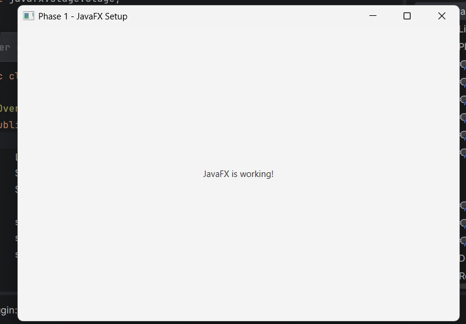

# Phase 1: JavaFX Setup — Methodology

## Objective

The objective of Phase 1 was to set up the JavaFX environment correctly and verify that a basic JavaFX application could run successfully before moving towards browser and DOM integration.

This phase was important because the complete project depends on JavaFX, so we first made sure that the JavaFX environment was working properly.

## Approach

We followed a step-by-step approach:

1. Set up the Java development environment.
2. Created a JavaFX project using Maven.
3. Added the required JavaFX dependencies.
4. Created a basic JavaFX application.
5. Tested the application and identified a JavaFX runtime issue.
6. Configured the project to run JavaFX through Maven.
7. Successfully executed the application and verified the JavaFX runtime.

## Environment Setup

The project was developed using:

- Java 21
- JavaFX 21
- Maven
- IntelliJ IDEA

Maven was used to manage the JavaFX dependencies and simplify the project setup.

## Basic JavaFX Application

To verify the setup, we created a simple JavaFX application.

The application:

- Extends the `Application` class.
- Overrides the `start()` method.
- Creates a `Label`.
- Places the label inside a `StackPane`.
- Creates a `Scene`.
- Displays the JavaFX window using `Stage`.

## The basic application displays:

> Hello! JavaFX is working.

This served as our initial test to confirm that JavaFX was correctly configured.

## Problem Encountered

Initially, when the application was run normally from the IDE, the following error appeared:

```text
JavaFX runtime components are missing
```

This indicated that the JavaFX runtime was not being loaded correctly when the application was launched directly from the IDE.

## Solution

To resolve the issue, we configured the JavaFX Maven Plugin and ran the application through the terminal using:

```bash
mvn clean javafx:run
```

This allowed Maven to load the required JavaFX runtime and dependencies correctly.

## Result

After running the application through Maven, the JavaFX window opened successfully and displayed:

> Hello! JavaFX is working.

This confirmed that the JavaFX environment was successfully configured and ready for the next phase of the project.



## Phase 1 Status

**Completed**

The JavaFX environment is now working successfully, and the project is ready to move towards browser integration using `WebView`.
The JavaFX environment is now working successfully, and the project is ready to move towards browser integration using
