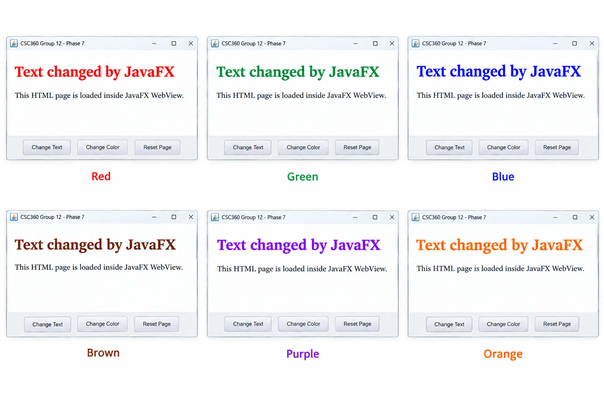

# Phase 7: Text and Color Changes — Methodology

## Objective

The objective of Phase 7 was to implement dynamic text and color changes in the HTML webpage through the JavaFX application.

This phase focused on allowing JavaFX buttons to modify the webpage content and change the text color dynamically using JavaScript and the HTML DOM.

## Approach

We followed a step-by-step approach:

1. Created JavaFX buttons for changing the text and color of the webpage.
2. Used `WebEngine.executeScript()` to execute JavaScript from JavaFX.
3. Modified the text of the HTML DOM element using `innerText`.
4. Changed the text color using the DOM `style.color` property.
5. Implemented multiple color options that can be applied by repeatedly clicking the `Change Color` button.
6. Added the `Reset Page` button to restore the original text and color.
7. Tested the text and color changes through the JavaFX interface.

## Text and Color Change Implementation

The JavaFX application uses `WebEngine.executeScript()` to modify the text and color of the HTML DOM element.

### Text Change

```java
changeTextButton.setOnAction(event -> {
    webEngine.executeScript(
            "document.getElementById('message').innerText = 'Text changed by JavaFX';"
    );
});
```
## Color Change

The Change Color button cycles through multiple colors each time it is clicked.

```
String[] colors = {"red", "green", "blue", "brown", "purple", "orange"};
int[] colorIndex = {0};

changeColorButton.setOnAction(event -> {

    webEngine.executeScript(
            "document.getElementById('message').style.color = '"
            + colors[colorIndex[0]] + "';"
    );

    colorIndex[0]++;

    if (colorIndex[0] >= colors.length) {
        colorIndex[0] = 0;
    }
});
```
The Reset Page button restores the original text and black color.

## Text and Color Change Flow

```text
JavaFX Button
      ↓
Button Action
      ↓
WebEngine.executeScript()
      ↓
JavaScript
      ↓
document.getElementById()
      ↓
HTML DOM Element
      ↓
Text / Color Modified
```

## Testing

The text and color changes were tested by running the JavaFX application and interacting with the buttons.

The following operations were verified:

- Clicking `Change Text` changes the original HTML text.
- Clicking `Change Color` changes the text color.
- Repeated clicks on `Change Color` cycle through the available colors.
- Clicking `Reset Page` restores the original text and black color.

The testing confirmed that the JavaFX application can dynamically control both the text and appearance of the HTML DOM element.

## Result

The JavaFX application successfully implemented dynamic text and color changes in the HTML webpage.

The `Change Text` button modified the webpage text, while the `Change Color` button dynamically changed the text color through JavaScript and the HTML DOM.

The `Reset Page` button successfully restored the original text and color.

This demonstrated complete interaction between the JavaFX interface and the HTML webpage through DOM manipulation.



## Phase 7 Status

**Completed**

Dynamic text and color changes were successfully implemented using JavaFX, `WebEngine`, JavaScript, and the HTML DOM. The application is now ready for the final testing and finalization phase.

