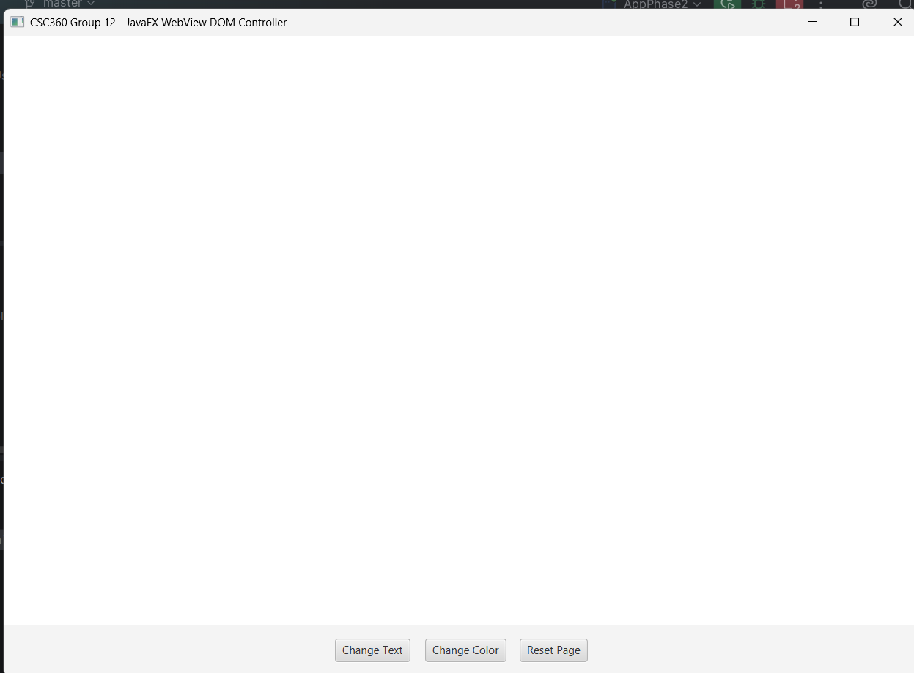

# Phase 2: Basic JavaFX Interface — Methodology

## Objective

The objective of Phase 2 was to create the basic user interface for the JavaFX browser application and organize its components using a suitable layout.

## Approach

We followed a step-by-step approach:

1. Created the main JavaFX application window using `Stage`.
2. Created a `Scene` to hold the application interface.
3. Used `BorderPane` as the main layout container.
4. Created a `WebView` to provide the browser area.
5. Created an `HBox` to arrange the buttons horizontally.
6. Added buttons for different DOM operations.
7. Placed the `WebView` in the center of the interface.
8. Placed the button bar at the bottom of the interface.
9. Connected button actions to JavaFX event handlers.
10. Tested the complete interfacde.

# Phase 2: Basic JavaFX Interface — Methodology

## Objective

The objective of Phase 2 was to create the basic graphical user interface of the JavaFX application.

After successfully setting up the JavaFX environment in Phase 1, this phase focused on creating the main application window and adding the required interface components.

The interface was designed to contain a browser area in the center and a button bar at the bottom. These buttons would later be used to interact with the HTML page and modify its DOM.

## Approach

We followed a step-by-step approach:

1. Created the main JavaFX application window using `Stage`.
2. Created a `Scene` to hold the application interface.
3. Used `BorderPane` as the main layout container.
4. Created a `WebView` to provide the browser area.
5. Created an `HBox` to arrange the buttons horizontally.
6. Created three JavaFX buttons for DOM operations.
7. Added the buttons to the `HBox`.
8. Placed the `WebView` in the center of the `BorderPane`.
9. Placed the button bar at the bottom of the `BorderPane`.
10. Added event handlers to the buttons.
11. Tested the complete JavaFX interface.

## Basic JavaFX Interface Implementation

The basic JavaFX interface was created using `WebView`, `WebEngine`, `Button`, `HBox`, `BorderPane`, and `Scene`.

The following code was used to create the browser area, buttons, button bar, main layout, and JavaFX scene:

```java
// Create browser
WebView webView = new WebView();
WebEngine webEngine = webView.getEngine();

// Create buttons
Button changeTextButton = new Button("Change Text");
Button changeColorButton = new Button("Change Color");
Button resetButton = new Button("Reset Page");

// Create button bar
HBox buttonBar = new HBox(15);
buttonBar.setStyle("-fx-alignment: center; -fx-padding: 15;");

// Add buttons to the button bar
buttonBar.getChildren().addAll(
        changeTextButton,
        changeColorButton,
        resetButton
);

// Create main layout
BorderPane root = new BorderPane();
root.setCenter(webView);
root.setBottom(buttonBar);

// Create scene
Scene scene = new Scene(root, 1000, 700);

stage.setTitle("CSC360 Group 12 - JavaFX WebView DOM Controller");
stage.setScene(scene);
stage.show();

````
## UI Structure

```text
JavaFX Application
        ↓
      Stage
     (Window)
        ↓
      Scene
        ↓
    BorderPane
     /      \
   TOP     CENTER
    │         │
   HBox     WebView
    │
 URL + Load

   BOTTOM
      │
 Change DOM


````
## Result

The basic JavaFX interface was successfully created.

The application now contains a JavaFX window with a `WebView` in the center and an `HBox` containing three buttons at the bottom:

- `Change Text`
- `Change Color`
- `Reset Page`

The interface was successfully displayed, and the buttons were added to provide controls for interacting with the webpage.



## Phase 2 Status

**Completed**

The basic JavaFX interface has been successfully created. The application now has the required layout and controls and is ready for the next phase of browser and DOM integration.
